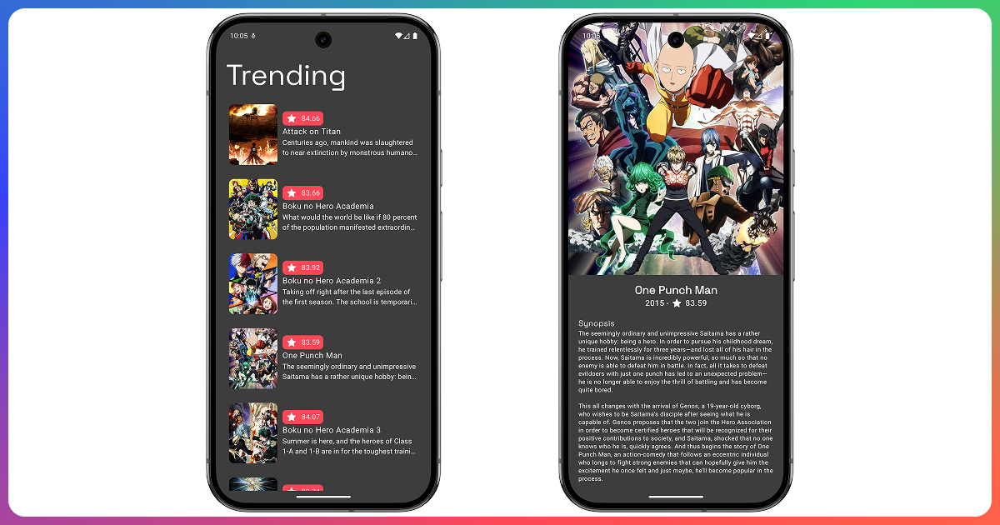

# TrendingAnime


TrendingAnime is an Android app that showcases trending and popular anime series. Built with Jetpack Compose and Material 3.


:rocket: Part of __*[TinyApps](https://erad.dev/tinnyapps.html)*__ by __*[erad.dev](https://erad.dev/)*__

## :eyes: Features

- Explore trending anime series
- View detailed anime information
- Dark and light themes
- Modern UI with Material 3
- Optimized performance using MVVM

## :hammer: Tech Stack

- Kotlin
- Jetpack Compose
- Material 3
- MVVM
- Retrofit
- Hilt
- Coil for image loading

## :running: Installation

1. Clone the repository
```
git clone https://github.com/erad-dev-mx/TrendingAnime.git
```
2. Open the project in Android Studio
3. Sync dependencies and run the app on an emulator or device

## :camera: Screenshots



## :sunglasses: Contributing

Contributions are welcome! Feel free to fork the project and submit a pull request.

## :scroll: License
This project is under the MIT license.

with :heart: erick